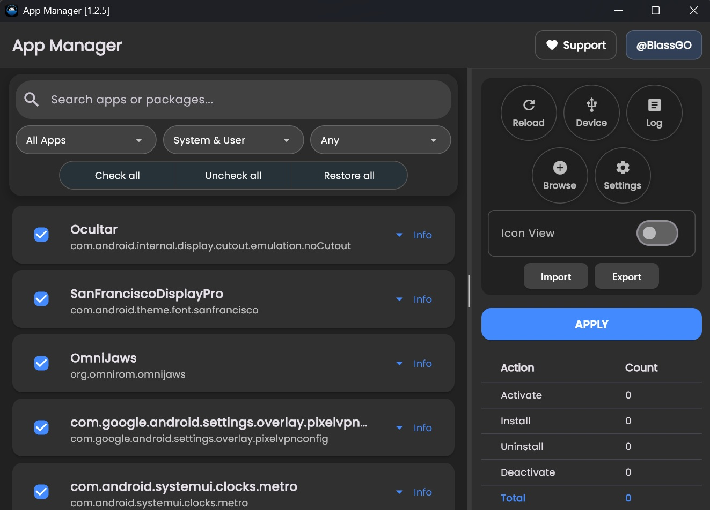
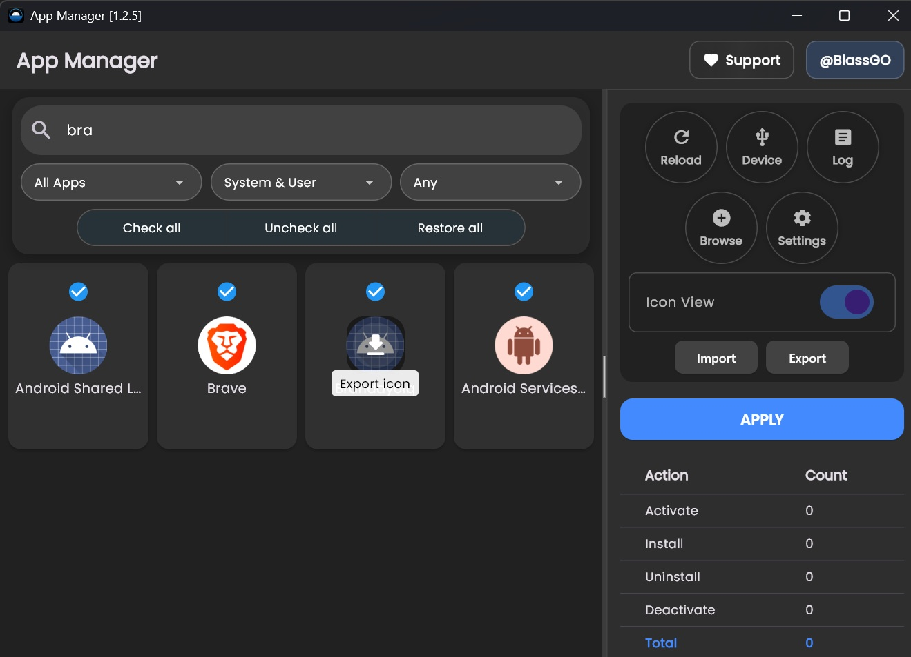

# Android App Manager - GUI

**App Manager GUI** is an open-source Flutter application. It leverages the [App Manager tool](https://github.com/BlassGO/App_Manager), a DalvikVM fragment, to extract detailed app information (icons, package details) without requiring app installation on the device.

## GUI
> <p align="center"></p>
> <p align="center"></p>

## Features

| Feature | Description |
|---------|-------------|
| **App Listing** | Displays all apps for the current user with ``Label`` (according to the device's language), ``Package``, ``ID``, ``APK path``, and ``Type`` (system/user) |
| **Icon View** | Shows apps with icons and labels, mimicking an app drawer. Allows icon extraction for specific apps |
| **Search Filters** | Filter apps by name, package, membership, state (ENABLED/DISABLED/UNINSTALLED), or sort by "Checked," "Unchecked," or "Applicable" states. The "Applicable" filter shows apps that will receive changes before applying them |
| **App Actions** | Perform **activate**, **deactivate**, **uninstall**, or **install** on multiple apps intuitively |
| **Device Management** | Switch between multiple devices (USB or wireless, previously connected) |
| **Log Viewer** | Integrated GUI log viewer for errors and exceptions |
| **JSON Export** | Export actions as JSON for replication on other devices. Share your own debloat lists |
| **App List Backup** | Export full app list for precise state replication / restoration. |
| **Remote App Lists** | Use remote app lists from external repositories to debloat devices directly from the interface |

## Prerequisites
- [**ADB**](https://developer.android.com/tools/releases/platform-tools) (Android Debug Bridge)
- **Windows 10+** or **Linux**
- Android device with USB debugging enabled

## First Steps

### Windows
1. **Download**:
   
   Get `app_manager.zip` from [GitHub Releases](https://github.com/BlassGO/AppManager-GUI/releases).
2. **Extract**:
   
   Unzip to a folder (`C:\AppManager` or custom).
3. **Connect Device**:
   - Enable USB debugging on your Android device.
   - Connect via USB or pair wirelessly (Settings > TCP/IP).
4. **Run**:
   - Double-click `app_manager.exe`.
   - If ADB isn't detected in your system's PATH, select it using the file explorer.

### Linux
1. **Download**:
   
   Get `app_manager.tar.gz` from [GitHub Releases](https://github.com/BlassGO/AppManager-GUI/releases).
2. **Extract**:
   ```bash
   tar -xzf app_manager_linux_x64.tar.gz -C ~/AppManager
   ```
3. **Connect Device**:
   - Enable USB debugging on your Android device.
   - Connect via USB or pair wirelessly (Settings > TCP/IP).
4. **Run**:
   ```bash
   cd ~/AppManager
   ./app_manager
   ```
   - If ADB isn't detected in your system's PATH, select it using the file explorer.

## Configuration

| Setting | Location | Description |
|---------|----------|-------------|
| **Never Uninstall** | Settings > Options | Deactivate instead of uninstalling apps. |
| **Export All Apps** | Settings > Options | Include all apps in JSON export, deducing actions to replicate state. |
| **Refresh all icons** | Settings > Options | Icons are cached per device. This option forces a full refresh, ensuring all app icons are always the latest, but it impacts performance. |
| **TCP/IP** | Settings > TCP/IP | Configure wireless device connections (IP/port). |
| **Select ADB** | Settings > Actions | Change the path from which the ADB executable is sourced. |

## Usage Tips
- **Multi-Select**: Checking or unchecking apps is all you need. Based on the current state of the app, all active apps will be checked, and all inactive or uninstalled apps will be unchecked. This way, you can reactivate or reinstall an app simply by checking it, or uninstall/deactivate an app by unchecking it:
  <p align="center"></p>

- **Show info**: Get more app info quickly:
  <p align="center"></p>
  
- **Logs**: Check the log viewer for troubleshooting:
  <p align="center"></p>

- **Devices**: Switch devices in the device manager for multi-device control:
  <p align="center"></p>

- **Remote Lists**: Use the remote list manager to access and apply debloat lists from external repositories, sorted by popularity and including author details:
  <p align="center"></p>

## Contributing
You can contribute to the project by submitting pull requests to the [AppManager-Repo repositories](https://github.com/orgs/AppManager-Repo/repositories), where resources for the remote list manager are sourced. Share your debloat lists for different devices or Android versions to help the community.

## Credits
- [BlassGO](https://github.com/BlassGO): Creator of App Manager for DalvikVM and Android App Manager GUI.

## License
> **Android App Manager GUI** is distributed under the GNU General Public License version 3.0 (``GPLv3``). This means that anyone can use, modify and distribute the software as long as they comply with the terms of the license.

  **->** See the [LICENSE](./LICENSE) file for more information on the license terms and conditions.